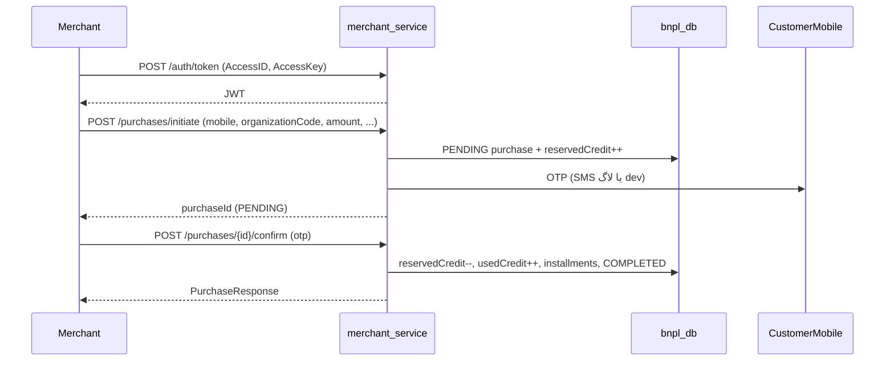

# پذیرندگان (Merchants) — توافق و برنامه اجرایی

تاریخ: 2026-09-24  
وضعیت: توافق‌شده (آماده پیاده‌سازی)

## ۱. خلاصه

پذیرنده جایی است که اعتبار BNPL مصرف می‌شود. مدیریت پذیرنده در پنل ادمین است؛ اعلام خرید فقط از طریق `merchant-service` و پس از تأیید OTP مشتری انجام می‌شود. ایجاد خرید از پنل سازمانی حذف می‌شود؛ فهرست و اقساط خریدها در پنل سازمانی می‌ماند.

## ۲. توافق‌های طراحی (Design decisions)

| موضوع | تصمیم |
|--------|--------|
| مرز دامنه | پذیرنده سراسری و مستقل از سازمان (گزینه A) |
| فیلد «شناسه» کسب‌وکار | فعلاً لازم نیست |
| فیلدهای پذیرنده | `name`, `phone`, `email`, `accessId`, `accessKeyHash`, `status`, `createdAt`, `updatedAt` |
| احراز هویت پذیرنده | `AccessID` + `AccessKey` (نه یوزرنیم/پسورد) |
| چرخه کلید | تولید سیستمی؛ AccessKey فقط یک‌بار نمایش؛ در DB هش؛ امکان چرخش کلید |
| توکن درخواست‌ها | `POST /auth/token` با AccessID/Key → JWT کوتاه‌عمر؛ بعد Bearer |
| سرویس | ماژول جدید `merchant-service` روی پورت **8083** |
| UI پذیرنده | در این فاز ساخته نمی‌شود |
| مالکیت جدول `merchants` و CRUD | فقط در `admin-service` |
| دیتابیس | مشترک `bnpl_db` |
| شناسایی مشتری در اعلام خرید | `mobile` + `organizationCode` |
| چند اعتبار برای یک موبایل | با `organizationCode` به اعتبار همان سازمان resolve می‌شود |
| بدنه initiate | اجباری: `mobile`, `organizationCode`, `amount`؛ اختیاری: `orderNumber`, `externalReference`, `description`, `shopName` |
| ارز | از `UserCredit` (نه از بدنه درخواست) |
| `shopName` | اختیاری در درخواست؛ در غیر این صورت نام پذیرنده |
| نمایش در پنل سازمانی | همان فیلد `shopName` روی خرید (بدون join اجباری به merchants در این فاز) |
| Idempotency | یکتایی `(merchant_id, order_number)` وقتی `orderNumber` پر است |
| مسیر ساخت خرید | فقط پذیرنده؛ منطق خرید در `merchant-service` پیاده می‌شود (جدا از پنل سازمانی) |
| حذف از پنل سازمانی | فقط ایجاد خرید (`POST`)؛ لیست/جزئیات/اقساط می‌ماند |
| جریان تأیید | دو مرحله‌ای با OTP |
| رزرو موجودی | فیلد جدا `reservedCredit` روی `user_credits` |
| ورود OTP | پذیرنده کد را از مشتری می‌گیرد و به API confirm می‌فرستد |
| OTP | TTL = ۳ دقیقه؛ حداکثر ۵ تلاش؛ سپس `CANCELLED` + آزادسازی رزرو |
| FK / unique روی purchases | از Liquibase مالک `purchases` یعنی `organization-panel-service` |

## ۳. جریان اعلام خرید



### قوانین موجودی

- قابل‌استفاده = `creditLimit - usedCredit - reservedCredit`
- **initiate:** افزایش `reservedCredit`، خرید با وضعیت `PENDING`
- **confirm موفق:** کاهش `reservedCredit`، افزایش `usedCredit`، ساخت اقساط، وضعیت `COMPLETED`
- **انقضا / شکست OTP:** کاهش `reservedCredit`، وضعیت `CANCELLED`

## ۴. برنامه اجرایی

### 4.1 دامنه و مهاجرت

- Entity جدید `Merchant` در `service/libs/domain`
- Liquibase در `admin-service`: ایجاد جدول `merchants`
- Liquibase در `organization-panel-service`:
  - ستون `user_credits.reserved_credit` (default 0)
  - FK اختیاری/الزام‌شده برای `purchases.merchant_id → merchants(id)` (پس از وجود جدول merchants)
  - محدودیت یکتایی روی `(merchant_id, order_number)` وقتی order number پر است
- DTOهای مشترک در `service/libs/dto` (پکیج‌های `admin` و `merchant`)

### 4.2 پنل ادمین

**API (`admin-service`):**

- `GET /api/merchants` — فهرست
- `POST /api/merchants` — ایجاد؛ در پاسخ AccessKey خام یک‌بار
- `PATCH /api/merchants/{id}` — ویرایش name/phone/email
- `PATCH /api/merchants/{id}/status` — فعال / غیرفعال
- `POST /api/merchants/{id}/rotate-access-key` — چرخش AccessKey (نمایش یک‌بار)

**UI (`ui/admin-panel`):**

- تکمیل صفحه `/dashboard/merchants` (جایگزین placeholder)
- جدول + افزودن + منوی عملیات (جزئیات/ویرایش/وضعیت/چرخش کلید)
- آیتم سایدبار از قبل اضافه شده است

### 4.3 سرویس `merchant-service` (پورت 8083)

- ماژول Maven جدید در parent `service`
- خواندن `merchants` و جداول خرید/اعتبار از همان Postgres
- `POST /api/auth/token` — AccessID/Key → JWT (فقط `ACTIVE`)
- `POST /api/purchases/initiate`
- `POST /api/purchases/{id}/confirm`
- OTP خرید جدا از OTP لاگین مشتری؛ در dev می‌تواند مثل customer در لاگ چاپ شود
- محاسبه اقساط: ترجیحاً انتقال/اشتراک `InstallmentScheduleCalculator` در lib تا فرمول با گذشته یکی بماند؛ orchestration خرید فقط در merchant-service

### 4.4 پنل سازمانی

- حذف `POST /api/purchases` از `PurchaseController`
- حذف/غیرفعال کردن `PurchaseService.create` مربوط به پنل (یا محدود کردن به عدم استفاده)
- حفظ `GET` فهرست خریدها و اقساط
- UI فعلی خریدها عمدتاً فقط مشاهده است؛ در صورت وجود دکمه/فرم ایجاد، حذف شود

### 4.5 مستندات و تست

- به‌روزرسانی `README.md` (پورت 8083 و نقش merchant-service)
- تست‌ها: توکن پذیرنده، initiate، confirm، idempotency با orderNumber تکراری، انقضای OTP و آزادسازی رزرو

## ۵. قرارداد API پیشنهادی (Merchant)

### احراز هویت

```http
POST /api/auth/token
Content-Type: application/json

{
  "accessId": "...",
  "accessKey": "..."
}
```

پاسخ: `accessToken`, `tokenType`, `expiresIn`

### آغاز خرید

```http
POST /api/purchases/initiate
Authorization: Bearer <token>

{
  "mobile": "09xxxxxxxxx",
  "organizationCode": "ORG-DEMO-01",
  "amount": 1000000,
  "orderNumber": "ORD-1",
  "externalReference": optional,
  "description": optional,
  "shopName": optional
}
```

### تأیید خرید

```http
POST /api/purchases/{purchaseId}/confirm
Authorization: Bearer <token>

{
  "otp": "123456"
}
```

## ۶. خارج از اسکوپ این فاز

- UI/پورتال پذیرنده
- فیلد شناسه ملی/کد کسب‌وکار پذیرنده
- API Key جدا از AccessID/Key+JWT
- نمایش join‌شده نام پذیرنده به‌جای `shopName` در UI پنل سازمانی
- اعلام خرید از پنل سازمانی

## ۷. پیش‌نیاز استارت در dev

ترتیب migrate مهم است: ابتدا changelog ادمین (`merchants`)، سپس changelog پنل (FK به merchants). هر دو سرویس به همان `bnpl_db` وصل‌اند.
